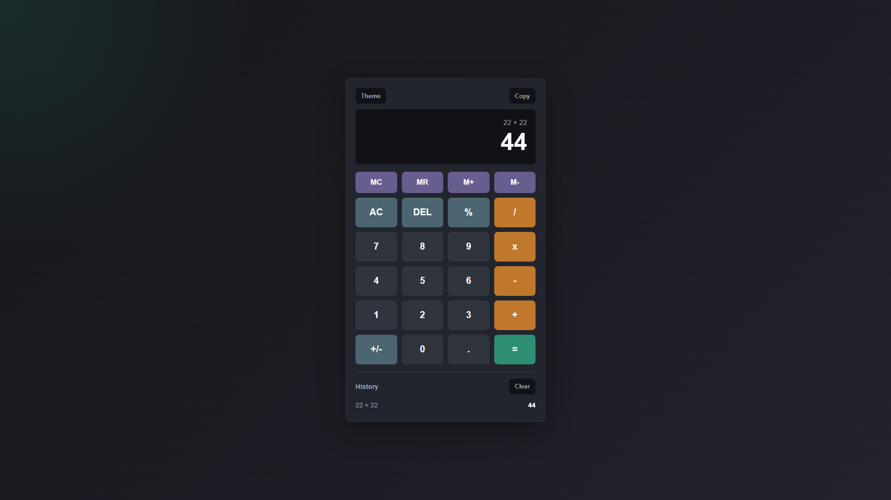

# Basic Calculator

A responsive calculator built with HTML, CSS, and JavaScript.

## Live Demo

[Open Live Demo](https://adhya-cloud.github.io/Adhyangupta_level2task1/)

## Features

- Addition, subtraction, multiplication, and division
- Percentage, delete, clear, and sign toggle
- Memory controls: MC, MR, M+, M-
- Calculation history
- Copy result button
- Light and dark theme toggle
- Keyboard support
